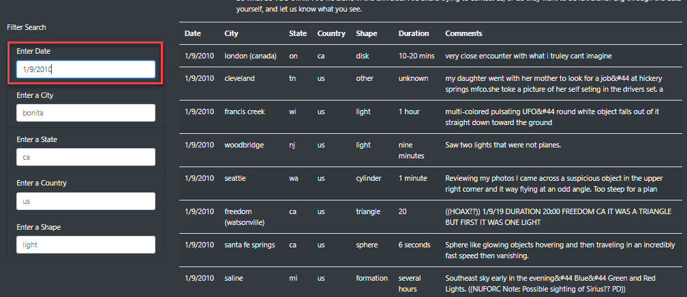
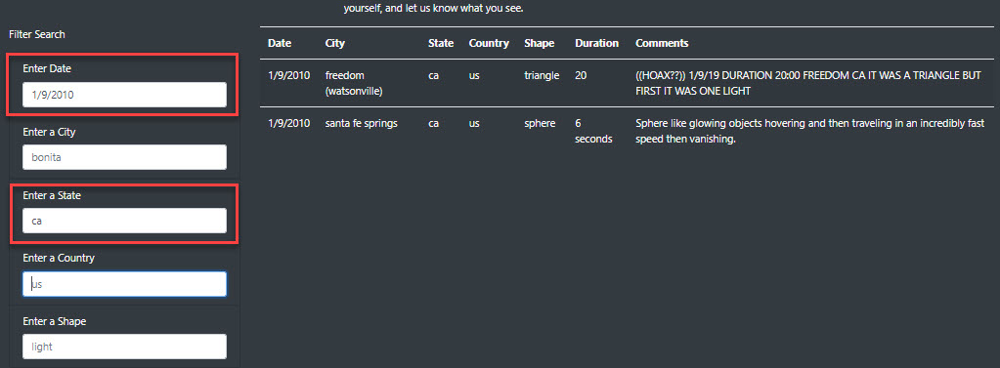
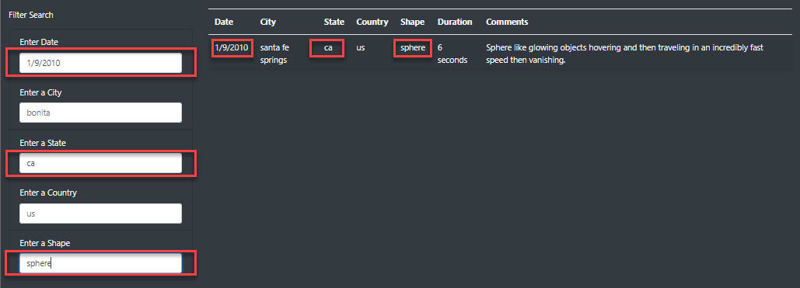

# UFO Sightings?

## Overview of the Project

The purpose of this project is to help Dana, a photojournalist, who is writing about her home town, McMinnville, Oregon. McMinnville is famous for its UFO sightings and has a large following of UFO enthusiasts. Dana has a javascript file which contains dates, locations, and other details about sightings. This project will create a table for the data and use filters to look at certain aspects of the data. The table with filters will then be displayed on a webpage along with Dana's article.

## Tools Used

- JavaScript
- HTML/CSS
- Visual Studio Code v1.62.3
- Bootstrap v4.4.1

## Results

The resulting webpage displays the results of UFO sightings in a table. The article about UFOs is placed directly above the table of UFO sightings and the search filters are to the left of the table. In the top left corner of the page is a text field, "UFO Sightings," that will clear the filter search when the user clicks on the text. Text examples are prefilled in the search boxes.

The "Filter Search" fields automatically filter the table results as a user enters criteria. The image below shows how the table is filtered by entering a specific date.

When the user enters additional search criteria, the returned lists is further filtered. In the image below, both the date and the state are filtered in the table on the right.

In the image below, the user has filtered for three criteria: date, state and shape.

## Summary

The webpage provides a snapshot of the data in a clear format and the user is able to filter the data. 

*Drawbacks*
- One of the drawbacks of this webpage is that the data source is static and limited since it is pulled from a local JavaScript file. By far the majority of the data on is from the United States and only includes a short time period in January 2010.
- A limitation of the filters is that the user needs to know the details of what to search for in order to get a successful result. Since the datset is so limited, most entries yield a null result, i.e., a date in 2011 will return no information. The user may need to scroll down the page to find the details of an item to enter in the search box.
- Once the user searches a field, there is no way to clear the data except to erase the text from the search box.

*Recommendations*
- One recommendation would be to do web scraping to pull data from worldwide databases which are constantly updated. This would provide fresh data as well as information on UFO sightings from around the world.
- The dataset would be better filtered using dropdown menus which are populated with the results of the dataset. By using dropdown menus, the user would not have to scroll down the page to find details of an item to search for. On the other hand, if the data is pulled from scraping databases across worldwide websites, there may be sufficient data to continue to use the search boxes without getting null results.
- The webpage should have a button to clear the search results so that the user does not need to manually clear the search parameters. Currently if the user clicks the "UFO Sightings" text in the upper left corner, the website will be refreshed and the data will be cleared. The user, however, does not know that this is the result of clicking the text.